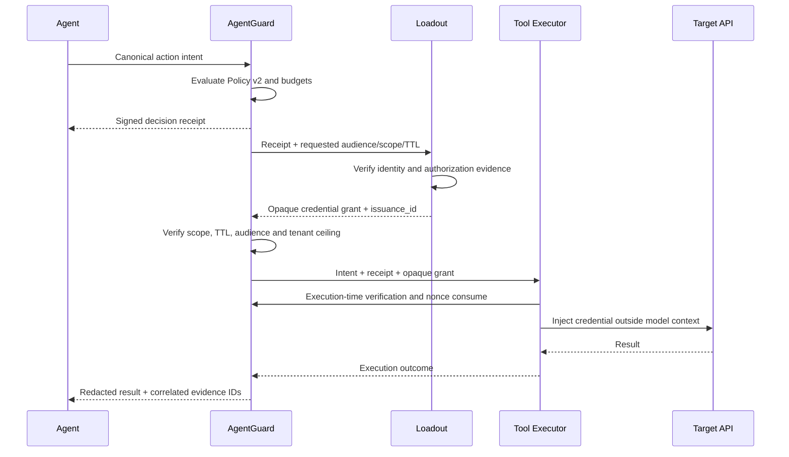

# Sequence

```mermaid
sequenceDiagram
    participant A as Agent
    participant G as AgentGuard
    participant L as Loadout
    participant E as Tool Executor
    participant T as Target API

    A->>G: Canonical action intent
    G->>G: Evaluate Policy v2 and budgets
    G-->>A: Signed decision receipt
    G->>L: Receipt + requested audience/scope/TTL
    L->>L: Verify identity and authorization evidence
    L-->>G: Opaque credential grant + issuance_id
    G->>G: Verify scope, TTL, audience and tenant ceiling
    G->>E: Intent + receipt + opaque grant
    E->>G: Execution-time verification and nonce consume
    E->>T: Inject credential outside model context
    T-->>E: Result
    E-->>G: Execution outcome
    G-->>A: Redacted result + correlated evidence IDs
```
